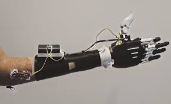
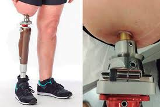
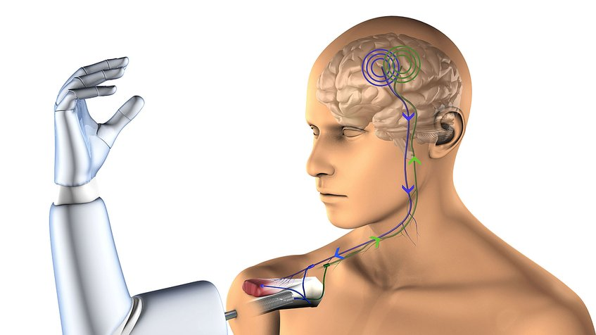

# ANÁLISIS DEL TRATAMIENTO DEL CASO

## *TRATAMIENTO INICIAL Y MANEJO MÉDICO*

Cuando una persona sufre una amputación, el tratamiento médico que se realiza en las primeras etapas es fundamental. Por ello es clave atender las condiciones necesarias para que el paciente pueda iniciar su recuperación con éxito. Por ese motivo desde el primer instante se pone énfasis en controlar el dolor, cuidar adecuadamente la zona afectada, más específicamente la parte del muñón. De esa manera prevenir cualquier tipo de complicación como infecciones o inflamaciones.[1]

Para el manejo de la herida postquirúrgica en personas amputadas: 

**Control de dolor:** Es importante empezar a tratar el dolor lo antes posible. Para ello se usan calmantes y si hace falta usar bloqueos nerviosos para aliviar el dolor. De ese modo evitar que aparezca ese dolor persistente o la sensación de que el miembro todavía está ahí. Lo mejor es combinar distintas formas de aliviar el dolor, ya que se ha comprobado que este enfoque ayuda mucho a que la persona se sienta mejor durante la recuperación.[2] 

**Cuidado del muñón:** Tener una limpieza regular ya que es importante mantener el muñón limpio y cambiar los vendajes con frecuencia usando técnicas compresivas. Esto ayuda a darle una buena forma y facilita para más adelante se pueda adaptar bien a una prótesis. Usar vendajes rígidos o elásticos sirve para disminuir la hinchazón y favorece que la herida cicatrice rápido. [3]

**Prevención de infecciones:** Cuidar bien la higiene donde se hizo la cirugía es importante para que no haya infecciones. Lo ideal es lavar el muñón con agua y con jabón todos los días, secándose con cuidado y sin frotar. También es clave estar atento al apósito que está puesta por la cirugía para saber si hay posible señal de infección, como enrojecimiento, sensación de calor en la zona o la presencia de secreciones. [4] 

**Educación al paciente y su entorno:** Tanto el paciente como su familia deben tener conocimiento de cómo cuidar el muñón en casa. Aprender a tratar las curas correctamente, reconocer señales de alerta y comprender la importancia de seguir las indicaciones médicas es fundamental para una recuperación exitosa. Este conocimiento no solo previene complicaciones, sino que también brinda seguridad y confianza durante el proceso de adaptación. [1] 

Para el control de diabetes: 

La persona con diabetes que sufre una amputación, es esencial que controle los factores que contribuyeron a la complicación. Para prevenir futuras amputaciones y mejorar la calidad de vida.

**Monitoreo constante de los niveles de glucosa en sangre:** Mantener la glucosa en sangre dentro de los niveles recomendados es importante para que no haya complicaciones futuras. Un buen control de glucemia ayuda mucho a reducir el riesgo de sufrir nuevas amputaciones. Para ver cómo va ese control a lo largo del tiempo, se utiliza una prueba llamada hemoglobina glucosilada (HbA1c), que da una idea general de cómo estuvo la glucosa en los últimos meses. [5]

**Uso adecuado de medicamentos antidiabéticos:** Según el "Algoritmo de Tratamiento de la Diabetes Mellitus Tipo 2", la metformina es el tratamiento de primera elección[Imagen1]. Sin embargo, si no se tolera, se puede iniciar tratamiento con otros antidiabéticos no insulínicos, priorizando la utilización de inhibidores del cotransportador sodio-glucosa tipo 2 (iSGLT2). La elección del tratamiento debe basarse en las características clínicas del paciente.[imagen2]  

**Control de factores de riesgo cardiovascular:** Es común que también enfrenté otros desafíos de salud como la presión arterial alta y el colesterol elevado. Estos factores, si no se controlan adecuadamente pueden aumentar significativamente el riesgo de problemas cardiovasculares. Por eso, es fundamental adoptar hábitos de vida saludables, como una alimentación equilibrada y la práctica regular de ejercicio, además de seguir el tratamiento médico indicado.[6]

**Educación nutricional y promoción de hábitos saludables:** Adoptar una alimentación equilibrada y mantener hábitos de vida saludables es esencial en el manejo de la diabetes. Una dieta con fibra proveniente de frutas, verduras, legumbres y cereales integrales, ayuda a regular los niveles de glucosa en sangre y mejora la sensibilidad a la insulina.[7] Además el ejercicio físico regular, adaptado a las capacidades de cada individuo, contribuye al control glucémico, a mantener un peso corporal saludable y a la mejora de la salud cardiovascular. Actividades como caminar, nadar o andar en bicicleta son recomendadas para personas con diabetes.[8]

## *REHABILITACIÓN Y TERAPIA*

La terapia para la extremidad residual, la adaptación a una prótesis y el proceso de rehabilitación tras una amputación de mano son fundamentales para recuperar la funcionalidad y lograr un mejor resultado en la mejora del paciente. Algunos puntos clave en la recuperación y tratamiento son los siguientes:

**- Tratamiento inicial y rehabilitación:** Después de una amputación, es crucial estabilizar al paciente y preparar el muñón para la adaptación protésica.

**- Ejercicios sin prótesis:** Se recomienda fortalecer la extremidad residual y el torso antes de usar una prótesis.

**- Cuidado de la piel y la cicatriz:** La insensibilización de la piel y el tratamiento de la cicatriz ayudan a mejorar la comodidad y funcionalidad.

**- Adaptación a la prótesis:** Se realizan ejercicios de control y movilidad para aprender a usar la prótesis de manera óptima.

**- Síndrome del miembro fantasma:** En algunos casos, los pacientes experimentan sensaciones en la extremidad amputada, lo que requiere un tratamiento específico.

 ### **1. Tratamiento inicial y preparación del muñón**
  
Después de una amputación, es fundamental estabilizar al paciente y preparar la extremidad residual para la adaptación protésica. Esto incluye:

**- Cuidado de la piel y la cicatriz:** Se realizan técnicas de insensibilización para mejorar la comodidad y funcionalidad.

**- Control del edema:** Se utilizan vendajes compresivos y fundas de silicona para reducir la inflamación y mejorar la forma del muñón.

**- Ejercicios sin prótesis:** Se recomienda fortalecer la extremidad residual y el torso antes de usar una prótesis.

 ###  **2. Adaptación a la prótesis** 
   
El proceso de adaptación a una prótesis de mano implica varias fases:

   **- Selección de la prótesis:** Existen prótesis mecánicas, mioeléctricas y estéticas, cada una con ventajas específicas.

   **- Ejercicios de control y movilidad:** Se enseña al paciente a manipular la prótesis con precisión.

   **- Uso en actividades diarias:** Se realizan entrenamientos para tareas como agarrar objetos, escribir y realizar movimientos finos.

###   **3. Manejo del síndrome del miembro fantasma**
   
Algunas personas experimentan sensaciones en la extremidad amputada, lo que puede requerir:

   **- Terapia de espejo:** Ayuda a reducir el dolor y mejorar la percepción sensorial.

   **- Estimulación nerviosa:** Técnicas como la estimulación eléctrica pueden aliviar molestias.

###  **4. Rehabilitación y reintegración**
  
El objetivo final es restaurar la movilidad e independencia del paciente. Esto incluye:

   **- Terapia ocupacional:** Se trabaja en la adaptación a la vida cotidiana y el uso de herramientas específicas.

   **- Apoyo psicológico:** La amputación puede tener un impacto emocional significativo, por lo que el acompañamiento psicológico es clave.

## *TECNOLOGÍAS DE APOYO Y DISPOSITIVOS MÉDICOS*

  **PRÓTESIS MIOELÉCTRICAS DE MIEMBRO SUPERIOR**

Las prótesis mioeléctricas utilizan señales eléctricas generadas por los músculos residuales del usuario para controlar los movimientos de la prótesis. Estas prótesis permiten realizar movimientos más naturales y precisos, mejorando la funcionalidad en actividades diarias. Están compuestas por electrodos que detectan la actividad muscular, procesadores de señales y actuadores que ejecutan los movimientos. [10]

  **PRÓTESIS OSTEOINTEGRADAS**

La osteointegración es una técnica quirúrgica que conecta directamente una prótesis al hueso del miembro residual, eliminando la necesidad de un encaje tradicional. Esta conexión directa mejora la transmisión de fuerzas, proporciona una mayor estabilidad y puede ofrecer retroalimentación sensorial al usuario, mejorando la percepción del entorno y la integración de la prótesis. [11]

  **PRÓTESIS CONTROLADAS POR SEÑALES CEREBRALES**

Investigadores han desarrollado tecnologías que permiten a las personas con amputaciones controlar prótesis robóticas mediante señales cerebrales. Utilizando interfaces neuronales y algoritmos de aprendizaje profundo, estas prótesis interpretan las intenciones del usuario, permitiendo movimientos más intuitivos y naturales. Este avance representa un paso significativo hacia la integración de sistemas prostéticos con el sistema nervioso humano. [12]

## *ENFOQUE PSICOSOCIALES*

Tras una amputación es importante recibir un apoyo psicológico, debido a que es importante afrontar de forma positiva la nueva vida para poder adaptarse a la sociedad y a una nueva calidad de vida,esto varía en la personalidad,circunstancias,etc para poder ayudar con el autoestima saludable y motivar al paciente para bien [13]. En el caso de nuestro paciente que es una amputación adolescente lo cual es una gran amenaza para la identidad sexual emergente. Por ejemplo una reacción de un niño de 13 años ante la noticia de que era necesaria una amputación de pierna para curar su sarcoma osteogénico con la declaración: “Ningún niño me va a mirar” [14].Por esta razón es recomendable mejorar las redes de apoyo del paciente.

-Proveer apoyo emocional: Distraer al paciente con sus actividades y temas de conversación favoritos o escuchar sus penas. El propósito principal de esta función es cuidar la salud mental de la persona y dejarle saber que no está sola.
  
-Ayudar con las relaciones sociales: Es posible que la persona se distancie socialmente y, aunque es saludable darle su espacio, es perjudicial si se aísla demasiado de sus círculos sociales. Para proveer este tipo de apoyo, es importante pasar un rato entre amigos y seres queridos.

-Proveer ayuda material e instrumental: Esto requiere estar dispuesto a proveer ayuda física con tareas del hogar también puede incluir proveer bienes materiales que le hagan falta o recolectar dinero.

-Ser una guía cognitiva: El paciente ha pasado por un gran cambio en su vida, por eso podemos ayudar a buscar información sobre las amputaciones y ofrecerles consejos. Generalmente, esta es una función profesional (psicólogo).[13]

# ANÁLISIS DEL CONTEXTO DEL CASO

## 1. Factores de Riesgo y Causas

Las amputaciones, especialmente de extremidades inferiores, se deben principalmente a:

 **- Diabetes mellitus**:  Responsable del 70% de amputaciones a nivel mundial. [15]. Asociada a pie diabético, neuropatía periférica e infecciones.  

 **- Neuropatía diabética**: Pérdida de sensibilidad en los pies que favorece lesiones no detectadas. [15]

  **- Infecciones**: Pie diabético infectado, con alta probabilidad de infección por bacterias multirresistentes.

  **- Aterosclerosis y enfermedad arterial periférica**: Obstrucción del flujo sanguíneo que impide la cicatrización de heridas. 

  **- Otros factores**: Tabaquismo, hipertensión, obesidad, hiperlipidemia. 

## 2. Epidemiología y Prevalencia

### A nivel mundial: 

-Se estima que ocurre una amputación cada **30 segundos** debido a complicaciones de diabetes. [16]

-**Diabetes tipo 2** representa el 85-90% de los casos de diabetes. [17]
  
### En Perú:

-**8%** de la población padece diabetes y solo **35%** mantiene control glucémico adecuado.
-En el Hospital Nacional Guillermo Almenara, el **40.1%** de pacientes hospitalizados con pie diabético sufren amputaciones con edad promedio de 68.8 años. [18]

    
## 3. Grupos de Riesgo y Factores Asociados

**- Edad**: Mayores de 65 años son los más afectados. [19]

**- Género**: Mayor incidencia en hombres (65%). [18]

**- Estilo de vida**: Sedentarismo, mala alimentación, tabaquismo.

**- Acceso a la salud**: Diagnóstico tardío y falta de atención especializada aumentan el riesgo.

## 🔗 Fuentes

[1] Instituto Nacional de Rehabilitación (INAREPS), Guía para la atención de pacientes amputados, Argentina.gob.ar. [En línea]. Disponible en: https://www.argentina.gob.ar/sites/default/files/inareps-guia-atencion-pacientes_amputados.pdf

[2] M. Brammah, A. Elsayed, y M. Tighe, "Manejo del dolor post-amputación de una extremidad", Anesthesia Tutorial of the Week, vol. 388, 2018. [En línea]. Disponible en: https://resources.wfsahq.org/atotw/manejo-del-dolor-post-amputacion-de-una-extremidad/

[3] Acute Post-Surgical Management of the Amputee – ES, Physiopedia. [En línea]. Disponible en: https://langs.physio-pedia.com/es/acute-post-surgical-management-of-the-amputee-es/

[4] Infection Prevention for Your Residual Limb, Prosthetic Solutions. [En línea]. Disponible en: https://prostheticsolutions.com/blog/infection-prevention-residual-limb/

[5] M. A. Moreno-Fernández, A. García-Romero, y M. Á. Rodríguez-Orozco, “Cuidados del paciente con amputación mayor de extremidad inferior”, Revista Mexicana de Medicina Física y Rehabilitación, vol. 36, no. 1, 2024. [En línea]. Disponible en: https://www.scielo.org.mx/scielo.php?pid=S2696-12962024000100009&script=sci_arttext

[imagen1] https://www.cadime.es/images/documentos_archivos_web/ALGORITMOS/2024/CADIME_ALGORITMO_DM2_2024.pdf
[imagen2] 
https://semergen.es/files/docs/biblioteca/guias/2024/algoritmoDiabetes2024.pdf

[6] Sociedad Española de Diabetes, Diabetes mellitus y riesgo cardiovascular: actualización de recomendaciones del grupo de trabajo, Sociedad Española de Diabetes, 2023. [En línea]. Disponible en: https://www.sediabetes.org/wp-content/uploads/Diabetes-mellitus-y-riesgo-cardiovascular_actualizacion-recomendaciones-grupo-de-trabajo.pdf

[7] Alimentación saludable, Vidasinazucar.com. [En línea]. Disponible en: https://vidasinazucar.com/alimentacion-saludable/

[8] F. González, “Prevención de la diabetes a través del ejercicio físico: eficacia y retos en salud pública,” Revista Médica, 2023. [En línea]. Disponible en: https://revistamedica.com/prevencion-diabetes-ejercicio-fisico-eficacia-salud-publica/

[9]J. Francisco, “Terapia y rehabilitación de miembros superiores,” [En línea]. Disponible en:
https://es.slideshare.net/JoseRiveros2/terapia-y-rehabilitaciondemiembrossuperiores

[10] A. Mendez and M. Zecca, “Wearable mechatronic devices for upper-limb amputees,” in Wearable Technology in Medicine and Health Care, Elsevier, 2018, pp. 157–177. [Online]. Available: https://www.sciencedirect.com/science/article/pii/B9780128213506000081

[11] O. J. Brånemark et al., “Osseointegration for amputees: Current state of direct skeletal attachment,” Journal of Orthopaedic Translation, vol. 39, 2023. [Online]. Available: https://www.sciencedirect.com/science/article/pii/S2666769X2300009X

[12] University of Minnesota, “BME technology allows amputees to control a robotic arm with their mind,” University of Minnesota College of Science and Engineering, 2021. [Online]. Available: https://cse.umn.edu/bme/news/bme-technology-allows-amputees-control-robotic-arm-their-mind

[13] R. Author, «La Importancia de tener una red de apoyo tras una amputación», RPS Medical, 28 de diciembre de 2022. https://www.rpsmedical.com/la-importancia-de-tener-una-red-de-apoyo-tras-una-amputacion/

[14] Beatriz BVG, «Tratamiento psicológico para pacientes amputados · BVG Psicologia», BVG Psicologia, 11 de julio de 2020. https://bvgpsicologia.com/tratamiento-psicologico-para-pacientes-amputados/ 

[15] Ministerio de Salud del Perú (MINSA), "El 70% de amputaciones de pies y piernas se realizan por diabetes en Hospital Dos de Mayo", Gob.pe, Sep. 26, 2017. [En línea]. Disponible: https://www.gob.pe/institucion/minsa/noticias/31238-el-70-de-amputaciones-de-pies-y-piernas-se-realizan-por-diabetes-en-hospital-dos-de-mayo

[16] Médicos Ecuador, "Amputaciones de miembros: piernas, manos", *medicosecuador.com*, [En línea]. Disponible: https://www.medicosecuador.com/articulos-tips-salud/amputaciones-de-miembros-piernas-manos.html

[17] N. C. D. Risk Factor Collaboration, "Worldwide trends in diabetes since 1980: a pooled analysis of 751 population-based studies with 4·4 million participants", *The Lancet*, vol. 387, no. 10027, pp. 1513–1530, 2016. [En línea]. Disponible: https://pubmed.ncbi.nlm.nih.gov/31518657/

[18] D. Ramírez Arce, "Incidencia de amputaciones en pacientes hospitalizados por pie diabético", *Tesis de Medicina, UNJBG*, 2021. [En línea]. Disponible: https://repositorio.unjbg.edu.pe/items/2594c936-f586-44ec-b736-b2b8d1135c0d

[19] J. A. Aragón-Durand et al., "Nationwide prevalence and clinical characteristics of inpatient diabetic foot in Peru," Primary Care Diabetes, vol. 15, no. 3, pp. 1–6, 2021. [En línea]. Disponible: https://pubmed.ncbi.nlm.nih.gov/33664012/

