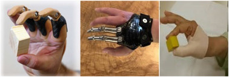
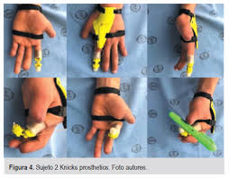

## CASO 3: AMPUTACIÓN - 

### 🟣 Problema

Paciente masculino de 15 años, sufrió amputación en la mano derecha tras manipulación de explosivo. Presenta pérdida de primer, segundo, tercer y cuarto dedo, además de cicatriz queloide retráctil en la palma. Utiliza un guante estético para cubrir la amputación, pero ha reportado incomodidad debido a la forma poco natural y la presión en los dedos al estirarlos, lo que le resulta incómodo para su uso prolongado. Aunque no necesita apoyo para sus tareas diarias, la prótesis actual no le proporciona el nivel de comodidad ni la funcionalidad deseada, especialmente en lo que respecta a la forma y la flexibilidad de los dedos.

### 📋 Lista de Requerimientos

### Funcionales

**Ofrecer un ajuste seguro y confortable**

Que el prototipo debe adaptarse de manera firme y cómoda a la mano del paciente; que mientras su uso no haya molestias, dolor ni irritaciones en la piel. Debe ser confortable para que pueda usarlo por horas; de esa manera permitiendo hacer sus actividades diarias sin tener que limitarse o sentir incomodidad 

**Mejorar la apariencia estética de la mano afectada**

El diseño del prototipo busca lograr que el paciente se sienta seguro con su imagen, procurando que la forma del prototipo sea similar a los dedos cumpliendo su anatomía de estos, ayudándolo a sentirse mejor consigo mismo y entorno

**Permitir ciertos grados de apertura y cierre de la mano**

El prototipo debe permitir al paciente abrir y cerrar la mano de forma fácil, imitando movimientos naturales como el agarre de pinza para sostener objetos pequeños (como un lápiz) y el agarre cilíndrico para sujetar cosas más grandes (como una botella). De esta manera, podrá adaptarse con facilidad a las distintas tareas de su vida diaria y recuperar parte de su independencia con la mano derecha.  

**Acomodar y proteger la zona de amputación** 

Como el paciente tiene cicatrices queloides en la palma de la mano, el diseño debe ajustarse a la forma de su mano de manera cuidadosa, distribuyendo la presión de forma equitativa. Es importante evitar roces o presiones fuertes que puedan irritar la piel o empeorar las cicatrices.

**Ser compatible con la terapia física y ocupacional en curso**

El prototipo debe acompañar el proceso de recuperación que el paciente ya está siguiendo, ayudándolo a fortalecer su mano, mejorar su movilidad y avanzar en su rehabilitación. Más que una herramienta aislada, debe ser un apoyo que facilite su esfuerzo diario por recuperar habilidades y ganar mayor independencia con la mano afectada.        

### No funcionales

**Apariencia natural**

Una prótesis con apariencia natural puede ayudar al paciente a sentirse más seguro y disminuir el estigma social. Esto incluye el color de piel (tonos realistas, incluso personalizados), la textura (simulación de piel humana), la forma anatómica de la mano y los dedos, e incluso detalles como uñas o vello fino.

**Durabilidad**

La prótesis está expuesta constantemente al uso continuo, lo que implica contacto físico, sudoración, y variaciones ambientales. Por ello, debe estar fabricada con materiales resistentes que le permitan mantener su integridad estructural y funcional con el paso del tiempo, evitando deformaciones o daños que obliguen a reemplazarla con frecuencia.

**Hipoalergenicidad**

La piel amputada, especialmente con cicatrices como las queloides retráctiles, es más sensible e inflamable a materiales irritantes. Por ello, los componentes en contacto con la piel deben ser hipoalergénicos y biocompatibles. Esto es aún más importante en un paciente joven cuyo cuerpo todavía está en desarrollo.

**Ligereza**

Un peso reducido en la prótesis es esencial para prevenir molestias o fatiga en el brazo afectado, especialmente durante su uso por largos periodos. Esto contribuye a una mejor postura y evita tensiones musculares innecesarias, algo especialmente importante en personas jóvenes en proceso de crecimiento.

**Fácil mantenimiento y limpieza**

Mantener una buena higiene es vital para evitar infecciones cutáneas, sobre todo en zonas sensibles como el muñón. Por ello, la prótesis debe estar diseñada para limpiarse fácilmente con productos comunes y sin dañarse. También se recomienda que tenga partes desmontables o de fácil acceso para una limpieza más eficiente.

### 🧠 Estrategias

**a. Prótesis funcional pasiva de agarre adaptable, ligera y resistente**

- Diseñada para permitir agarres simples (bicicleta, útiles escolares, objetos del hogar), mediante estructuras semiflexibles o articulaciones sin motor.

- Resistente al uso diario y a tareas ocasionales en campo sin ser pesada ni mecánicamente compleja.

- Su diseño evita presión sobre zonas sensibles, especialmente la cicatriz.

**b. Estructura modular impresa en 3D con zonas diferenciadas de flexibilidad**

- Módulos de dedos en TPU (flexible) combinados con Nylon PA12 o ABS (estructural).

- Fácil de reemplazar o ajustar con el tiempo.

- Articulaciones protegidas contra tierra, lluvia leve o polvo, pero sin sobredimensionar la protección (no es para uso industrial).

**c. Sistema de ajuste anatómico con confort térmico para clima de sierra**

- Interior hecho en silicona médica combinada con una capa térmica ligera (como neopreno médico o textil térmico respirable).

- Conserva el calor en el muñón sin generar sudoración excesiva.

- Distribuye presión de forma uniforme, protegiendo la cicatriz retráctil.

**d. Estética funcional adaptable a preferencia personal**

Ofrecer una cobertura externa que:

- Pueda simular piel humana (para contextos sociales).

- O adoptar un diseño técnico/deportivo (por ejemplo, acabado mate gris o negro) para actividades físicas o de campo. Así, el paciente podrá elegir entre un estilo discreto o uno más robusto según la ocasión.

### 🛠 Conceptos

**Estrategia a:** Prótesis diseñadas para ser movidas con las extremidades residuales como las articulaciones del dedo.(Mayor durabilidad, movimiento más fluido al hacer acciones propias) [1]

**Estrategia b:** Varias partes modeladas por separado las cuales se articulan y son móviles a partir de una polea que, al ser halada por una palanca a nivel de la muñeca, reproduce la flexión de esta generando la flexión de las falanges medial y distal de la prótesis.[2]

**Estrategia c:**

**Estrategia d:** No presentan movimiento, en la fabricación se emplean materiales como el látex flexible o silicona (se podría usar para poder cubrir la prótesis mecánica, prótesis mioeléctricas, hoy en dia son muy caras)[4]

### 🧩 Módulos 

**Módulo de Sensado**

¿Qué hace?: Detecta intención de movimiento o presión residual del muñón.

Ejemplos de componentes:

- Sensores de presión (FSR) colocados en el muñón.
  
- Sensores de flexión en muñeca o tendones remanentes.

**Módulo de Control**

¿Qué hace?: Procesa las señales de los sensores y decide activar o mover la prótesis.

Ejemplos de componentes:

- Microcontrolador tipo Arduino Nano, ESP32 o equivalente pequeño.
  
- Algoritmo de interpretación de señales.

**Módulo de Alerta (opcional en caso de fallo o baja energía)**

¿Qué hace?: Informa al paciente de fallos, falta de batería o necesidad de ajuste.

Ejemplos de componentes:

- Buzzer (sonido), LED (luz) o vibrador integrado en la prótesis.

**Módulo Actuador**

¿Qué hace?: Ejecuta el movimiento de los dedos (flexión/extensión parcial).

Ejemplos de componentes:

- Micromotores eléctricos, servomotores pequeños.

- Mecanismos de poleas o tendones artificiales.

**Módulo de Energía**

¿Qué hace?: Suministra energía a todo el sistema.

Ejemplos de componentes:

- Batería recargable de litio-polímero (Li-Po).

- Circuito regulador de voltaje.

 ### 📚Bibliografía

 
[1]  E. G. Rodríguez, L. G. Cano, y B. S. Pastor, "Actualización en prótesis para amputaciones parciales de mano y dedos," Rehabilitación, vol. 56, no. 4, pp. 375–382, 2022, doi: 10.1016/j.rh.2022.04.002.
[2]  R. Galán y M. J. Vergara, "Prótesis impresa en 3D para la rehabilitación de amputaciones digitales: presentación de un diseño mecánico," Revista Colombiana de Cirugía Plástica y Reconstructiva, vol. 25, no. 2, 2019.
[3]  J. L. Brito, M. X. Quinde, D. Cuzco, y J. I. Calle, "Estudio del estado del arte de las prótesis de mano," 2013.
[4] R. P. P. Andrés, “Desarrollo de una prótesis de mano, acoplable al muñón, para jóvenes con mutilaciones traumáticas,” 2017. [En línea]. Disponible: https://repositorio.puce.edu.ec/items/ba3b433a-55d9-4f59-b253-adba884a183c

