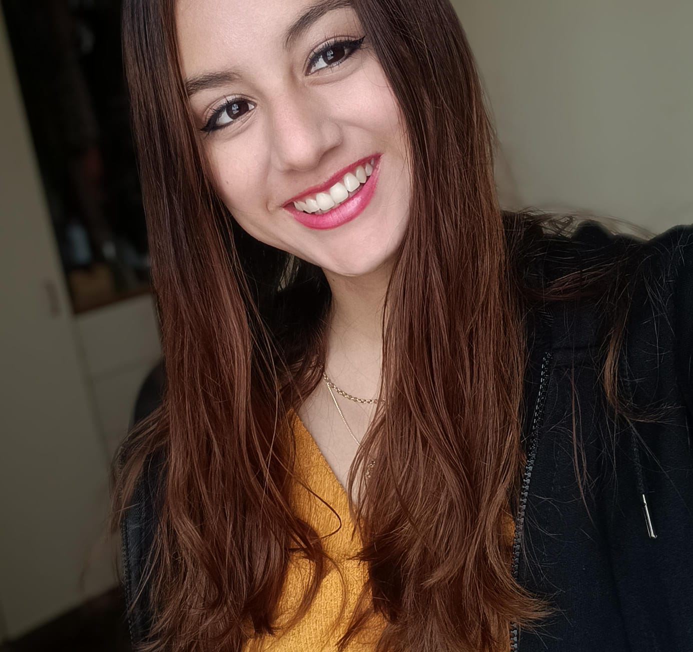

## BIENVENIDOS AL GRUPO 7

 

### Proyecto de Rehabilitación Integral – Paciente 3

Este repositorio documenta el desarrollo de un plan de rehabilitación integral para un paciente de 15 años con amputación parcial de los dedos de la mano derecha, como consecuencia de un accidente con un explosivo en Andahuaylas.

### 🧠 Objetivo del proyecto
Desarrollar un enfoque interdisciplinario (fisioterapia, terapia ocupacional, apoyo psicológico y diseño de prótesis) para mejorar la funcionalidad, autoestima e independencia del paciente.

### 👥 Integrantes

| Foto | Nombre | Rol |
|------|--------|-----|
|  |Sebastián Xavier Cruz Flores  | Coordinador y prototipado electrónico |
|  | Mauricio Joaquín Espinoza Pozo | Prototipado electrónico |
|  | Vanesa Nola Guerra Canchari | Prototipado electrónico |
|  | Pablo Laurente Salazar | Diseño y manufactura digital |
|  | Ana Valeria Mori Tiznado | Diseño y manufactura digital |

