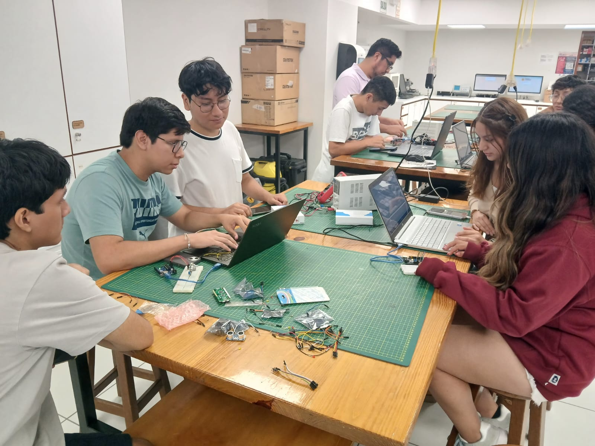
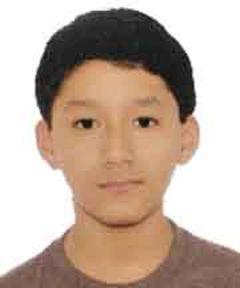
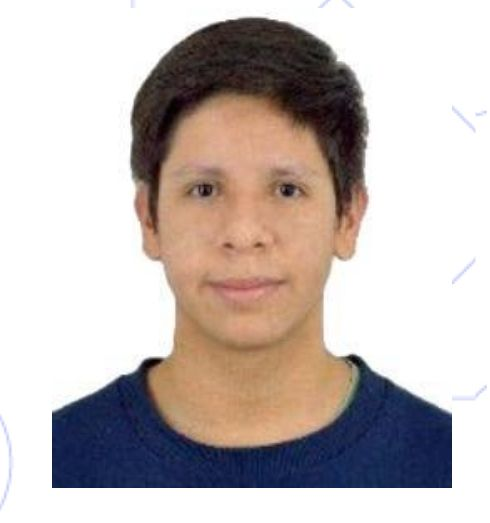
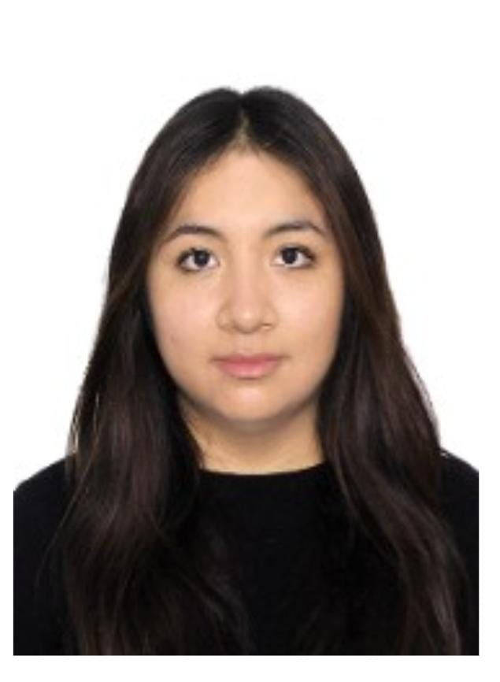
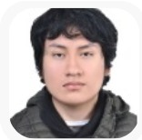
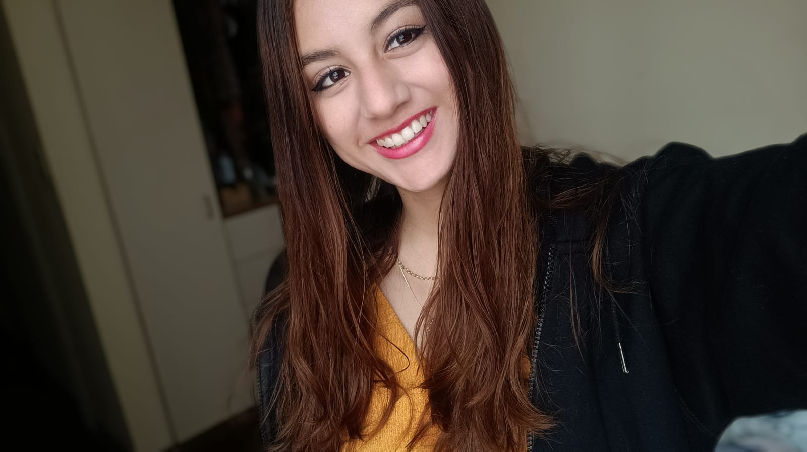

## FUNDAMENTOS DE BIODISEÑO - GRUPO 07 - CICLO 2025.1

**BIENVENIDOS AL REPOSITORIO DEL GRUPO 07**

Este es un espacio donde compartiremos cada uno de nuestros progresos, análisis e investigaciones acerca del caso clínico basado en la amputación que iremos trabajando cada semana. Pueden visualizar los avances en la sección de "ENTREGABLES". 

 

### Contenido del curso
- Unidad Didáctica 1: Identificar la necesidad o el problema
- Unidad Didáctica 2: Crear conceptos de solución
- Unidad Didáctica 3: Desarrollar la solución
- Unidad Didáctica 4: Comunicar los resultados

### Objetivo del curso

Este curso introduce al estudiante en el proceso de implementación de proyectos, como al desarrollo de productos y servicios en el campo de la ingeniería biomédica a través del diseño y fabricación de dispositivos que atienden una necesidad médica.

Los alumnos serán confrontados a desafíos reales del campo médico en el ámbito nacional o global, así propondrán una solución innovadora trabajando en equipo, la cual diseñarán y presentarán un prototipo funcional de baja resolución. Aplicarán el proceso de diseño determinístico en ingeniería que comprende la identificación de la necesidad y/o problema, el estado de la técnica, generación de estrategias y conceptos de solución y prototipado rápido. También aprenderán de manera práctica las herramientas para comunicación científica (oral y escrita) así como trabajo efectivo en equipo.

### Proyecto de Rehabilitación Integral – Paciente 3

Este repositorio documenta el desarrollo de un plan de rehabilitación integral para un paciente de 15 años con amputación parcial de los dedos de la mano derecha, como consecuencia de un accidente con un explosivo en Andahuaylas.

### 🧠 Objetivo del proyecto
Desarrollar un enfoque interdisciplinario (fisioterapia, terapia ocupacional, apoyo psicológico y diseño de prótesis) para mejorar la funcionalidad, autoestima e independencia del paciente.

### 👥 Integrantes

| Foto  | Nombre                        | Rol                                |
|-------|-------------------------------|------------------------------------|
|  | Sebastián Xavier Cruz Flores     | Coordinador y prototipado electrónico |
|   | Mauricio Joaquín Espinoza Pozo   | Prototipado electrónico           |
|     | Vanesa Nola Guerra Canchari      | Diseño y manufactura digital      |
|      | Pablo Laurente Salazar           | Prototipado electrónico           |
|  | Ana Valeria Mori Tiznado        | Diseño y manufactura digital      |

### Temática del proyecto

### Justificación del proyecto 

### Docentes y asesores del curso

- Manuel Zúñiga 
- Lewis De La Cruz
- Ivan Calle
- Carmen Llanos
- Karen Amaya

### Bibliografía

